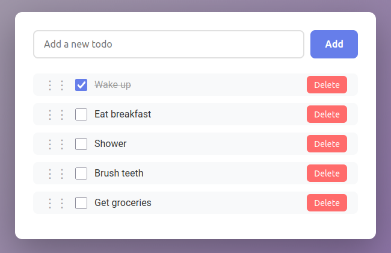

# Simple Todo App
This is a simple todo app I made using Claude and ChatGPT. You can add new items, check them off, delete them, and reorder them with drag and drop.

# Usage
To start the app, run `./server.py [PORT]`. The port is optional, and by default 8000. This will start the server and then open the URL in your default browser.

The user interface is fairly simple. Add items with the "Add" button, delete items with the "Delete" buttons, and check items off with the checkmarks. You can also edit items by double clicking on their text. You can reposition an item by holding the drag handle on the left and dropping it into a new position.
