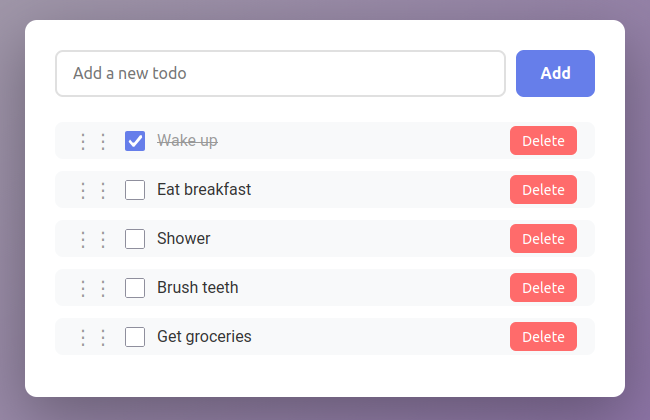

# Simple Todo App
This is a simple todo app I made using Claude and ChatGPT. You can add new items, check them off, delete them, and reorder them with drag and drop. Everything is saved completely locally.



# Usage
To start the app, run `./server.py`. This will start the server and open the app in your default browser.

The user interface is fairly simple. Add items with the "Add" button, delete items with the "Delete" buttons, and check items off with the checkmarks. You can reposition an item by holding the drag handle on the left and dropping it into a new position. You can also edit items by double clicking on their text. 

You can customize the launch of the app with a few arguments. If you provide a file, like `./server.py path/to/save/todo.json`, it will save the the data in that custom location. This is useful for having multiple TODO lists. If a save file is not provided, the app saves the data in the app data directory (e.g., on Linux, `~/.local/share/todo/todo.json`), which is useful for having a global TODO list.

You can also provide a custom port with `--port` (default: 8000) and a custom host with `--host` (default: localhost).

# Installation on Linux
You can launch the app without further installation by calling `./server.py`. However, I recommend also adding the app to your PATH so that you can more easily open a TODO list from any directory. Here is how I recommend installing the app on Linux:
1. Download the source code:
```
git clone https://github.com/cooljoseph1/todo-app.git
```
2. Move to the `/opt` directory:
```
sudo mv todo-app /opt/todo-app
```
3. Create a symlink in `/usr/local/bin` to `server.py`
```
sudo ln -s /opt/todo-app/server.py /usr/local/bin/todo
```
The directory `/usr/local/bin` is usually already on the PATH. If it's not, you can edit your `~/.bashrc` file to add it to the PATH.


You should now be able to launch the TODO app by calling `todo`.
